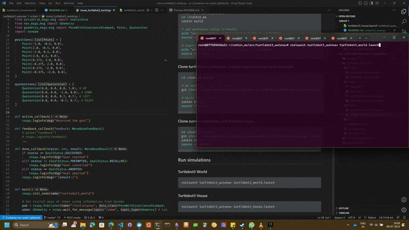
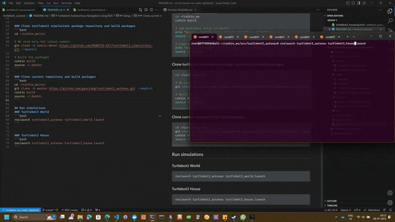

# Turtlebot3 Autonomous Navigation using ROS

## Setup
### Install ROS Noetic
- Follow instructions at [noetic/Installation/Ubuntu - ROS Wiki](http://wiki.ros.org/noetic/Installation/Ubuntu)
- Install Python catkin tools: `sudo apt-get install -y python3-catkin-tools`

### Install packages for Gazebo and Turtlebot
```bash
sudo apt-get install ros-noetic-joy ros-noetic-teleop-twist-joy \
  ros-noetic-teleop-twist-keyboard ros-noetic-laser-proc \
  ros-noetic-rgbd-launch ros-noetic-rosserial-arduino \
  ros-noetic-rosserial-python ros-noetic-rosserial-client \
  ros-noetic-rosserial-msgs ros-noetic-amcl ros-noetic-map-server \
  ros-noetic-move-base ros-noetic-urdf ros-noetic-xacro \
  ros-noetic-compressed-image-transport ros-noetic-rqt* ros-noetic-rviz \
  ros-noetic-gmapping ros-noetic-navigation ros-noetic-interactive-markers
```

```bash
sudo apt install ros-noetic-dynamixel-sdk
sudo apt install ros-noetic-turtlebot3-msgs
sudo apt install ros-noetic-turtlebot3
```

### Create catkin workspace
```bash
# add ROS noetic setup to bashrc
echo "source /opt/ros/noetic/setup.bash" >> ~/.bashrc
source ~/.bashrc

# create workspace
mkdir -p ~/catkin_ws/src
cd ~/catkin_ws
catkin build

# add workspace setup to bashrc
echo "source ~/catkin_ws/devel/setup.bash" >> ~/.bashrc
source ~/.bashrc

# export TURTLEBOT3_MODEL so that you don't need to do it again and again
echo "export TURTLEBOT3_MODEL=burger" >> ~/.bashrc
source ~/.bashrc
```

### Clone turtlebot3 simulations package repository and build packages
```bash
cd ~/catkin_ws/src

# We need only the latest commit
git clone -b noetic-devel https://github.com/ROBOTIS-GIT/turtlebot3_simulations.git --depth=1

# Build the packages
catkin build
source ~/.bashrc
```

### Clone current repository and build packages
```bash
cd ~/catkin_ws/src
git clone -b master https://github.com/gaurishg/turtlebot3_autonav.git --depth=1
catkin build
source ~/.bashrc
```

## Run simulations
### Turtlebot3 World
```bash
roslaunch turtlebot3_autonav turtlebot3_world.launch
```


### Turtlebot3 House
```bash
roslaunch turtlebot3_autonav turtlebot3_house.launch
```
